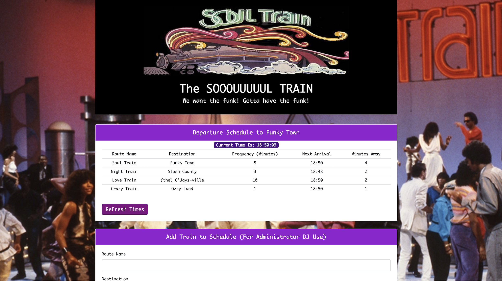

# Firebase HW Assignment

## Page preview: 


## About the project:
We had to build an app that a hypotetical train administrator could use to add train lines to a table. The user fills out input fields on a form and submits the data. The data is then pushed up to my Firebase database. Immediately, the data is then appended back down into a table on the DOM. 

  * When adding trains, administrators should be able to submit the following:
    * Train Name
    * Destination
    * First Train Time -- in military time
    * Frequency -- in minutes
  * Calculate when the next train will arrive; this should be relative to the current time.
  * Users from many different machines must be able to view same train times.
  * The train data in the table should not reset when the screen is reloaded.

## Techologies used to build:
  * HTML
  * CSS
  * Bootstrap
  * jQuery
  * Javascript
  * Firebase
  * Moment.js

## Methodology:

I reviewed the class activities in Firebase and used them as guides in helping to building my app. I also reviewed Daniel's Moment.js cheatsheet which was every helpful. I leaned on the docs from Firebase, jQuery and Moment.js. All of the basic specs have been met I believe.

Pushing the data up to the Firebase data was pretty straighfoward as guided by our class exercises. So was formatting the times using Moment. I ran into some bugs trying to get the table appended correctly back onto the DOM. For some reason, the method outlined in the timesheet activity wasn't working for me so I made a tiny deviation. I created another ID in the tbody tag to append the table to and it worked. I also got a functioning time clock running. Now, for the bonus section, I'm trying to make the minutes away numbers in the last column dynamic.

## Code Snippits I like:
  1. I made a button so the user can click on to refresh the next arrival and minutes away             times since they're not (yet) dynamic. The train schedule data ("Route Name", "Destination",      "Frequency in Minutes" does not reset)
   
```
      var refresh = $('#refresh');

      refresh.on('click', function() {
      location.reload(true);
```

  1. This is my dynamic clock in the table section (Must give props to Daniel for this!). I made this so the user can have a clock to reference the next arrival and minutes away columns. My stretch goal is to make the Next Arrival and Minutes Away numbers all dynamic.
  2. 
```
    // This fumnction uses moment's time method to format the clock time in military time to the seconds.
      var currentTimeClock = function() {
      var currentTime = moment();
      var currentTimeFormatted = moment(currentTime).format('HH:mm:ss');
      currentTimeDOM.text(currentTimeFormatted);
  }
    // Using setInterval method to make the clock dynamic. 
      setInterval(currentTimeClock, 1000);
      currentTimeDOM.text(currentTimeClock);
```

  3. This is pretty simple but it's a solution to a bug where the data was not appending to the table. I followed the timesheet exercise and in there, the data was appended to an id in the      thead section. That was not working for me so I experimemnted with work-arounds and targeting     a new id in the tbody section worked. I just like this because I probably would not have          thought of this so quickly one-and-a-half to two weeks ago. 
  4. 
```    
      tbody id="for-append" style="font-family: Monaco, 'Courier New', monospace; font-size: 13px; text-align: center;">

      var trainScheduleTable = $('#for-append');
      trainScheduleTable.append(tableRow);
```

## Link to portfolio page: 

https://github.com/Olisun/Updated-Portfolio-Page

